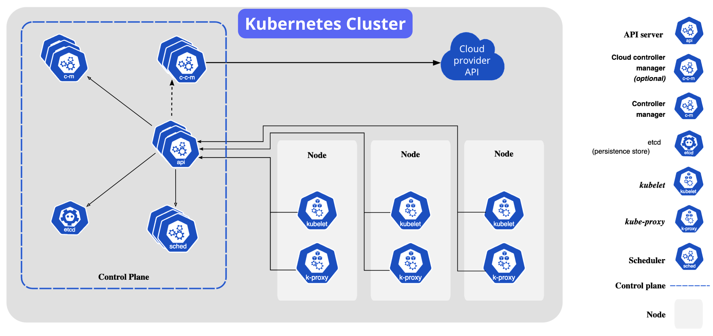

# Deploying an image

- kubectl create deployment (command will create a "deployment" for us)
- The name of the deployment (this can be anything, it's used to identify the deployment)
- The ID of the Docker image we want to deploy (it would be a full URL if we weren't hosting the image on Docker Hub, which is the default)

```sh
kubectl create deployment synergychat-web --image=bootdotdev/synergychat-web:latest
```

## Expose the application

```sh
kubectl port-forward PODNAME 8080:8080
```

## Edit Deployments

- this will edit the deployment we created not the pods

```sh
kubectl edit deployment synergychat-web
```

## Wide output of the pods

```sh
kubectl get pods -o wide
```

## Replica Sets

- A ReplicaSet maintains a stable set of replica Pods running at any given time. It's the thing that makes sure that the number of Pods you want running is the same as the number of Pods that are actually running

```sh
kubectl get replicasets
```

## YAML Config

- First, download a copy of your deployment's YAML file and save it in your current directory:

```sh
kubectl get deployment synergychat-web -o yaml > web-deployment.yaml
```

## Apply the changes

```sh
kubectl apply -f web-deployment.yaml
```

## How to edit deployments in YAML

```sh
kubectl get deployment synergychat-web -o yaml > web-deployment.yaml
```

## Config Maps

- There are several ways to manage environment variables in Kubernetes. One of the most common ways is to use ConfigMaps.

```sh
kubectl get configmaps
```

## Ingress

- To work with an ingress first we need to enable it in minikube:

```sh
minikube addons enable ingress
```

```sh
minikube tunnel -c
```

## Storage in Kubernetes

- API_DB_FILEPATH: /var/lib/synergychat/api/db.json
- Perhaps to your surprise, the messages are gone! What??? Why??? We saved them to the filesystem, didn't we? Well, we did, but in Kubernetes the filesystem is ephemeral. That means that when a pod is deleted, the filesystem is deleted with it.

## Kubernetes volume (EPHIMERAL)

- Data persistence
- Data sharing across containers
- volume that will be shared across all containers in the crawler pod, and scale up the number of containers in the pod.

- Add a volumes section to spec/template/spec.

```sh
volumes:
  - name: cache-volume
    emptyDir: {}
```

- Add a new volumeMounts section to the container entry. This will mount the volume we just created at the /cache path.

```sh
volumeMounts:
  - name: cache-volume
    mountPath: /cache
```

## It's important to remember that while it's common for a pod to run just a single container, multiple containers can run in a single pod. This is useful when you have containers that need to share resources. In other words, we can scale up the instances of an application either at the container level or at the pod level

- If you think about it, it's not even just when pods are explicitly deleted with kubectl that we need to worry about data loss. Pods can be deleted for several reasons:

- The node they're running on could fail
  A new version of the image was published (code was updated, etc)
  A new node was added to the cluster and the pod was rescheduled

## PERSISTANCE VOLUME

- Static PVs are created manually by a cluster admin
- Dynamic PVs are created automatically when a pod requests a volume that doesn't exist yet

### Generally speaking, and especially in the cloud-native world, we want to use dynamic PVs. It's less work and more flexible

```sh
volumes:
  - name: synergychat-api-volume
    persistentVolumeClaim:
      claimName: synergychat-api-pvc
```

- Then mount it in the container under the /persist directory:

```sh
volumeMounts:
  - name: synergychat-api-volume
    mountPath: /persist
```

- Update the environment variable to use the new mount path: /persist/db.json

## Namespaces

- Namespaces are a way to isolate cluster resources into groups. They're a bit like directories on your computer, but instead of containing files, they contain Kubernetes objects. As you've already learned, every resource in Kubernetes has a name. Some of our names include:

- synergychat-api-configmap
- api-service
- api-deployment
- web-deployment

- You can only use a name once. It is a unique identifier.That's how kubectl apply knows when it should create a new resource and when it should update an existing one. Namespaces allow us to use the same name for different resources, as long as they're in different namespaces

```sh
kubectl get namespaces
```

or

```sh
kubectl get ns
```

### If you have a small cluster with only a few applications, you can probably get away with just using the default namespace. However, if you have a large cluster with many applications, and in particular many teams working on those applications, namespaces are a great way to keep things organized

## Intra-cluster DNS

- Kubernetes automatically creates DNS entries for each service that can be used to route HTTP traffic between services. The format is:

```sh
<service-name>.<namespace>.svc.cluster.local
```

- It's now time to connect the crawler and api applications. The api needs to be able to make HTTP requests directly to the crawler so that it can get the latest data to power the "stats" slash command.

- front-end -> api -> crawler

- In reality, the .svc.cluster.local isn't needed in most scenarios. If you just use http://<service-name>.<namespace> for the api->crawler communication, it will work. When working in the same namespace, you can even just use http://<service-name>. That wouldn't work for us in our scenario just because the crawler is in its own separate namespace

- Internal is better than external
  Unless a service really needs to be made available to the outside world, it's better to keep it internal to the cluster. Internal communications are great because:

- It's faster (assuming nodes are close to each other physically)
- No public DNS is required
- Communication is inherently more secure because it runs on an internal network (usually don't even need HTTPS)

### As a general rule, all HTTP servers should have a(n) service resource but should only have a(n) ingress resource if they need to be exposed to clients outside the cluster

## metrics-server

```sh
minikube addons enable metrics-server
```

- Metrics

```sh
kubectl top pod
```

## Resource Limits

- Memory is measured in bytes, so we can use the suffixes Ki, Mi, and Gi to specify kilobytes, megabytes, and gigabytes, respectively. For example, 512Mi is 512 megabytes.

- CPU is measured in cores, so we can use the suffix m to specify milli-cores. For example, 500m is 500 milli-cores, or 0.5 cores.

- Assuming everything is working properly, you should see that the pod is using about 50 milli-cores of CPU. That's because k8s is throttling the pod to ensure that it doesn't use more than 50 milli-cores

- Add a CPU limit of 50m to the deployment.

```yaml
apiVersion: apps/v1
kind: Deployment
metadata:
  labels:
    app: synergychat-testcpu
  name: synergychat-testcpu
spec:
  replicas: 1
  selector:
    matchLabels:
      app: synergychat-testcpu
  template:
    metadata:
      labels:
        app: synergychat-testcpu
    spec:
      containers:
        - image: bootdotdev/synergychat-testcpu:latest
          name: synergychat-testcpu
          resources:
            limits:
              cpu: 50m
              memory: 32Mi
```

## Breaking the Limits

- OOMKILLED (out of memory, killed)

```sh
apiVersion: v1
kind: ConfigMap
metadata:
  name: synergychat-testram-configmap
  namespace: default
data:
  MEGABYTES: "500"  # this is why it got OOMKILLED
```

- Set the MEGABYTES environment variable to 10 and apply the change, then delete the pod so that the new environment variable takes effect

## Horizontal Pod Autoscaling (HPA)

- A Horizontal Pod Autoscaler can automatically scale the number of Pods in a Deployment based on observed CPU utilization or other custom metrics. It's very common in a Kubernetes environment to have a low number of pods in a deployment, and then scale up the number of pods automatically as CPU usage increases.

```sh
apiVersion: autoscaling/v1
kind: HorizontalPodAutoscaler
metadata:
  name: testcpu-hpa
spec:
  scaleTargetRef:
    apiVersion: apps/v1
    kind: Deployment
    name: synergychat-testcpu
  minReplicas: 1
  maxReplicas: 4
  targetCPUUtilizationPercentage: 50
```

- This hpa will monitor the CPU usage of the pods in the testcpu deployment. Its goal is to scale up or down the number of pods in the deployment so that the average CPU usage of all pods is around 50%. As CPU usage increases, it will add more pods. As CPU usage decreases, it will remove pods. You can find the algorithm it uses here if you're interested.

- Apply the hpa, then run the following commands every few seconds to watch as the number of pods scales up

## HPA - Web (doesn't have much going on in terms of compute resources)

- Delete the line "replicas: 3" from the web deployment. This will allow our new autoscaler to have full control over the number of pods.

## Nodes



- We've talked about how in a production environment, you'll have multiple nodes in your cluster. For this course, we've been using a single node cluster with minikube. The nice thing about Kubernetes is that almost everything you do with it is abstracted away from the underlying infrastructure with the kubectl CLI.

- GKE also has a cool auto-pilot mode that makes it so that you don't have to worry about managing nodes at all.

- The nice thing about a managed offering is that it can be configured to handle autoscaling at the node level. This means that you can set up your cluster to automatically add and remove nodes based on the load of your cluster

- The control plane is responsible for managing the cluster. It's where the API server, scheduler, and controller manager live. The control plane used to be called "master nodes", but that term is deprecated now

- When you hear the word "node" used in isolation it's usually referring to worker nodes. In fact, because I'm using GKE for Boot.dev, when I run:

```sh
kubectl get nodes
```

```sh
NAME                                       STATUS   ROLES    AGE     VERSION
gk3-kube-prod-nap-1cmjprlt-92e1dc91-jmi8   Ready    <none>   5d21h   v1.25.12-gke.500
gk3-kube-prod-nap-1cmjprlt-dfe4d6de-cq0k   Ready    <none>   5d21h   v1.25.12-gke.500
```

## Resource Requests

- A resource request is the amount of a resource that a pod requests from the node it's running on. This is different from a resource limit, which is the maximum amount of a resource that a pod is allowed to consume before its throttled or killed.

```text
And we have 4 pods:
Pod    Node    RAM
Pod 1  Node 1  3GB
Pod 2  Node 1  3GB
Pod 3  Node 2  3GB
Pod 4  Node 2  3GB
This is valid. Currently, only 6/8 GB of RAM is being used on each node. The trouble is, even though each node has 2GB of RAM left, if we try to add another pod, and it ends up utilizing more than 2GB of RAM (like the 3GB it will likely need), it will crash.
```

- If we add a resource request of 3GB, Kubernetes will know that each pod needs 3GB of RAM to run. If we try to schedule a new pod with the request in place, k8s will gracefully tell us it doesn't have enough resources to do so, or it will use a node in the cluster that has at least 3GB of RAM available.

```yaml
resources:
  limits:
    memory: 40000Mi
  requests:
    memory: 40000Mi
```

```text
Events:
  Type     Reason            Age   From               Message
  ----     ------            ----  ----               -------
  Warning  FailedScheduling  48s   default-scheduler  0/1 nodes are available: 1 Insufficient memory. preemption: 0/1 nodes are available: 1 No preemption victims found for incoming pod.
```

## Requests

- One of the most important things to get right when working with pod autoscalers in Kubernetes are the resource requests and limits. If you don't set them correctly, you can end up with a situation where your pods are crashing, or your autoscaler is scaling up too many pods.

### Generally speaking, my rule of thumb is:

- Set memory requests ~10% higher than the average memory usage of your pods
- Set CPU requests to 50% of the average CPU usage of your pods
- Set memory limits ~100% higher than the average memory usage of your pods
- Set CPU limits ~100% higher than the average CPU usage of your pods

#### Memory is scarier

- Memory is the scariest resource to run out of. If you run out of CPU, your pods will just slow down. If you run out of memory, your pods will crash. For that reason, it's more important to add a buffer to your memory requests than your CPU requests.

#### Limits are for protection

- Limits should only take effect when a pod is using more resources than it should. Limits are like a safety net. If your limits are constantly being hit, you should either increase them or fix your application code so that it uses fewer resources.

#### Requests are for scheduling

- Because requests are used to schedule pods, you want to make sure that your requests are high enough that once scheduled, your pods will have the resources, but not so high that you're wasting resources. If you set your requests too high, you'll end up with a situation where you can't schedule pods because k8s thinks it doesn't have enough resources, even though it does.

#### requests is for scheduling, limits is for setting sane maximums in Kubernetes.
